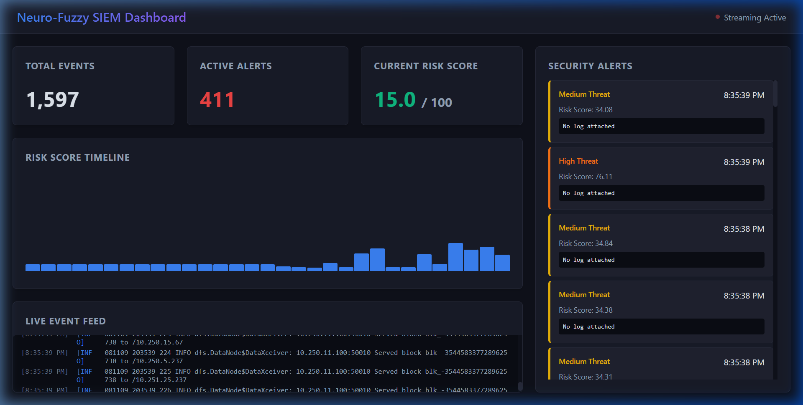
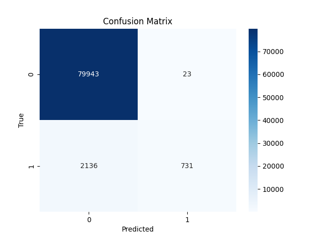
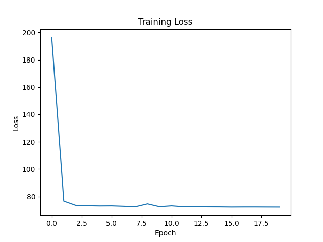
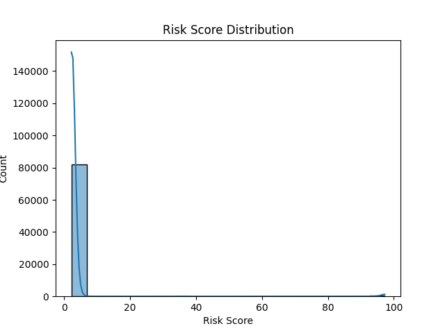

# Adaptive Neuro-Fuzzy Risk Scoring for Real-Time SIEM


## Overview
This project implements a complete, end-to-end **Adaptive Neuro-Fuzzy Inference System (ANFIS)** for real-time alert scoring in SIEM (Security Information and Event Management). 

By combining the feature representation learning of neural networks with the transparent reasoning of fuzzy logic, this system provides more accurate and interpretable risk scores than traditional models. The project contains custom PyTorch ML models, a streaming inference engine via FastAPI, and a real-time dark-theme dashboard application.

## Key Features
- **Hybrid Architecture**: Neural networks for feature learning + Fuzzy reasoning for risk assessment.
- **Real-Time Processing**: Streaming sliding-window inference with WebSocket support for low-latency alert prioritization.
- **Explainable AI**: Fuzzy rules provide human-readable justification for risk scores.
- **Modern Dashboard UI**: Built with React and Vite featuring live charts, streaming log terminal, and dynamic threat alerts.
- **Windows Optimized**: Built-in support for Windows Event Log patterns and behavioral metrics.

---

## 📸 Dashboard Screenshots

### Live Streaming Dashboard


### Model Accuracy & Metrics
| Confusion Matrix | Loss Curve | Risk Score Dist |
| ---------------- | ---------- | --------------- |
|  |  |  |

---

## Project Structure

```text
SIEM/
├── assets/                  # Project screenshots and demo videos
├── backend/                 # FastAPI Real-time Inference Server
│   ├── database.py          # SQLite telemetry schema
│   ├── predictor.py         # ANFIS model Stateful Sliding-Window interface
│   └── server.py            # Async REST API & WebSocket manager
├── dataset/                 # Raw/Preprocessed Windows HDFS Logs
├── frontend/                # Vite + React Dashboard UI
│   └── src/App.tsx          # Real-time WebSocket consumer logic
├── model_training/          # ML Pipeline Scripts
│   ├── inference.py         # Offline Log inference script
│   ├── model.py             # PyTorch `NeuroFuzzySIEM` Neural Architecture
│   ├── preprocessing.py     # Log parser and Sequence Featurizer
│   └── train.py             # PyTorch Training Loop
├── Architecture             # Detailed Layer Architecture
├── simulator.py             # Event log batch-streamer to test live system
└── neuro_fuzzy_siem.pth     # Saved Model Checkpoint
```

---

## 🚀 Getting Started

To run the full end-to-end real-time dashboard from scratch:

### 1. Start the Backend API (FastAPI)
The backend requires `fastapi`, `uvicorn`, `websockets`, `sqlalchemy`, and `torch`.
```powershell
# Open a terminal
.\.venv\Scripts\Activate.ps1
cd backend
uvicorn server:app --reload --port 8000
```

### 2. Start the Frontend Dashboard (React + Vite)
```powershell
# Open a second terminal
cd frontend
npm run dev
# -> Opens on http://localhost:5173/
```

### 3. Start the Log Simulator
The simulator replays `dataset/HDFS.log` lines to the REST API over HTTP, producing the live data stream.
```powershell
# Open a third terminal
.\.venv\Scripts\Activate.ps1
python simulator.py
```

Watch the dashboard at `http://localhost:5173/` react to the incoming logs in real-time!

---

## Methodology

### Phase 1: Data Engineering
- **Parsing**: Advanced regex parsing of Windows logs against templates.
- **Feature Extraction**:
    - **Categorical**: EventID sequences.
    - **Numerical**: Temporal gaps, error counts, frequency statistics (using sliding windows).

### Phase 2: Model Training (`train.py`)
- **Neural Layer**: Train representation models to extract high-level feature vectors (`model.py`).
- **Fuzzy Layer**: Adapt fuzzy sets (`Low`, `Medium`, `High`) and combine with rule vectors.
- **Result**: `neuro_fuzzy_siem.pth` weights and `processed_data.pkl` config.

### Phase 3: Real-Time Simulation & Dashboard (`backend/` & `frontend/`)
- Maintain a deque-backed stateful processor via `StatefulPredictor` to run inference sequentially over live logs without re-reading disks.
- Broadcast anomalous behavior instantly for UI alerting.

## Dataset
This project uses the **TII-SSRC-23** context for benchmarking detection accuracy and pretraining neural representations, alongside standard HDFS datasets for block parsing.
